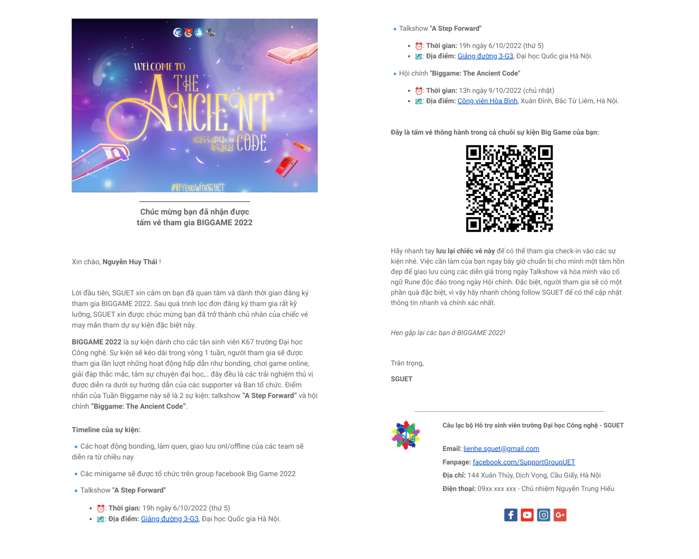

# Attendance system using QR code
Điểm danh người tham gia sự kiện qua QR gửi trong thư mời (qua email) chỉ sử dụng các công cụ đơn giản như Google Sheet & Google Forms.  

## Giới thiệu
Với việc triển khai các bước dưới đây, bạn có thể:
- Tạo email thư mời/vé tham gia sự kiện/chiến dịch,... trong đó kèm mã QR.
- Khi người dùng đến tham gia, bạn có thể sử dụng thiết bị (của bạn), quét QR trên ticket/thư mời của người dùng, để
    - Biết được người tham gia đó có hợp lệ (nhận được thư mời từ ban tổ chức hoặc đã mua vé) hay không.
    - Kiểm soát được danh sách người đã đến tham dự sự kiện theo **thời gian thực**. 

## Luồng hoạt động

- Về cơ bản, ảnh trên đã mô tả các thành phần và chức năng riêng của chúng trong hệ thống của mình, trông thì có vẻ phức tạp nhưng thực ra đơn giản thôi.
- Một số trick được áp dụng khi dùng từng công cụ mà kết hợp chúng lại nó thực hiện được công việc mình đang cần:
  - `Google script`: thường mọi người dùng Google Sheets chỉ để làm bảng tính, thay thế Excel thôi, nhưng thực tế thì nó còn có khả năng tự động hóa các công việc rất mạnh nữa. Trong trường hợp này mình sẽ viết code để gửi mail tới cho danh sách người tham gia. 
  - `Google Forms`: Forms thì ai cũng biết, nhưng mình tìm hiểu được thêm việc có thể submit form tự động bằng link kèm params. Tức là QR code của mỗi người thực tế sẽ là một link trỏ đến link điền form với param là login code của người đó, vậy khi mình scan lúc điểm danh (thực chất là truy cập link đó), thì kết quả sẽ được lưu lại là 1 phản hồi cho form đó. Đây cũng là chìa khóa của công cụ này.
  - `Github`: dùng Github để lưu code thì rõ rồi, nhưng mình lại dùng nó để lưu ảnh cơ. Tại sao? Bởi vì nó có thể lưu & giữ nguyên tên file ảnh, còn khi upload lên Google Drive chẳng hạn, link ảnh của bạn sẽ bị mã hóa bằng hash và không có cấu trúc -> mình không thể tự động detect được link ảnh QR cho từng vé mời. 
  - <a href="https://chrome.google.com/webstore/detail/simple-mass-downloader/abdkkegmcbiomijcbdaodaflgehfffed">`Simple mass downloader`</a>: cái này thì mình pick bừa 1 extension trên Chrome Store mình cần để download ảnh từ link thôi, không có gì đặc biệt.

## Cách thực hiện
- Đầu tiên bạn truy cập [sheet này](https://docs.google.com/spreadsheets/d/134WF55HkPuSOizzZRZ8eW9xXsTUWFQwtFiXPMBiw1tI/edit?usp=sharing). Chọn `File` > `Make a copy` cho tiện hoặc bạn cứ đọc để hiểu nguyên lý hoạt động chứ sheet này mình vừa làm vừa nháp, hơi xấu nên khó nhìn.

  

- Có một số cột mình cần giải thích:
  - `Email`: email của từng người tham gia, tất nhiên vì bảo mật của sự kiện nên mình đã xóa đi.
  - `Login code`: như đã giải thích bên trên, cái này là mã đăng nhập của mỗi người, bạn tự tạo theo format nào bạn thích, miễn không trùng nhau là được. Bạn có thể dùng MSSV, CCCD nếu thích.
  - `Link form`: link đến form điểm danh. Các ô trong cột đấy đều có giá trị như nhau, mình kéo xuống để cho tiện thôi.
  - `Form entry point`: nó là entry point của ô câu trả lời khi bạn điền form. Cái này hơi technical 1 xíu, tí giải thích bên dưới. Tương tự cột link form, các ô trong cột này đều có giá trị như nhau, mình kéo xuống để cho tiện thôi.
  - `Generated QR code`: mình dùng API từ [image-charts.com](image-charts.com) để tạo từ **_link form_** + **_entry point_** + **_login code_**, bạn chỉ cần copy y hệt là được.
  - `Thứ tự tải xuống`: khi mình tải QR code đã tạo xuống, mình cần phải tải theo đúng thú tự (cái này có extension Simple Mass Downloader lo), và upload lên 1 cơ sở dữ liệu lưu trữ được như github.
  - `Link ảnh cuối`: là link ảnh mình đã upload lên github, thứ tự tương ứng với từng người chơi và login code. Phải đúng thứ tự, không thì người này sẽ nhận được vé của người khác.

- Tiếp theo, mình đi viết [script](https://viblo.asia/p/google-apps-script-co-gi-hay-ho-07LKX2xElV4) cho sheet này. Bạn có thể nhấn vào phần `Extensions` > `App Script`. Mình đã viết sẵn script trong đó, bao gồm 2 file.
  - `template.html`: Đây là template mail động như bình thường thôi, mình dùng MJML để viết rồi dịch sang HTML, bạn hoàn toàn có thể sử dụng các công cụ khác. Mail có kèm hình ảnh và thông tin sự kiện của mình, tên người tham gia và QR. Vì mình muốn customize phần tên và QR code cho từng người nên những phần đó mình sẽ để dưới dạng biến truyền vào.
    
  - `mã.gs`: đây là phần script của mình. Có 3 function chính:
    - _getData()_: lấy thông tin người tham dự (tên, email, QR) từ sheet.
    - _getEmailHtml()_: lấy template mail mình đã chuẩn bị ở file `template.html`.
    - _sendMail()_: lấy thông tin, template mail để gửi đến email của từng người dùng.
    
  - 2 file mình đều đã để trong repo github này, bạn có thể vào đọc trước xem.

- Mình đi tạo Form checkin:
  - `Giao diện Form`: đơn giản thôi, chỉ cần 1 câu hỏi duy nhất.
  
    
    
  - `Lấy địa chỉ entry point`: đầu tiên mình bật F12, rồi thử gửi 1 câu trả lời mẫu, rồi vào tab `Network`, tìm `formResponse` rồi xem phần `Payload` là ra, copy lại vào Sheet bên trên là được.
  
    
  
  - Phần form check-in này mọi người nhớ chỉ cấp quyền điền form cho địa chỉ email của Ban tổ chức máy dùng để scan khi người ta đi vào sự kiện. Chứ ai cũng scan & điền form được thì họ tự điểm danh cho nhau rồi.

- Customize sheet phản hồi để kiểm soát người tham gia theo thời gian thực. Cái này ai hiểu sheet cơ bản đều làm được rồi, chỉ bằng những câu lệnh điều kiện đơn giản thôi nên mình cũng không nói dài nữa & chỉ để [mẫu](https://docs.google.com/spreadsheets/d/1WR0jBY9Mn63x19XxeQhmGXuzvN-sr1pXHGQPQASSbfc/edit?usp=sharing) thôi nhé.

  

- Xong rồi thì quay lại app script sheet rồi chạy để tự động gửi mail đến người tham gia thôi.

  

## Các link liên quan
- [Mẫu sheet thông tin người tham gia](https://docs.google.com/spreadsheets/d/134WF55HkPuSOizzZRZ8eW9xXsTUWFQwtFiXPMBiw1tI/edit?usp=sharing)
- [Mẫu sheet checkin](https://docs.google.com/spreadsheets/d/1WR0jBY9Mn63x19XxeQhmGXuzvN-sr1pXHGQPQASSbfc/edit?usp=drive_link)
- [Gscript sử dụng](code.js)
- [Template mail động](template.html)
- [MJML để viết mail động](https://mjml.io/)

## Phần bổ sung
- Đây là phần nghiên cứu mình hoàn toàn tự mày mò dựa trên sự kiện mình tham gia ở năm ngoái, không tham khảo ở bất cứ nguồn nào. Vì vậy, mình hi vọng nếu các bạn thấy bài viết này có ích & sử dụng ý tưởng này có thể dẫn link tới repo này của mình để nhiều người biết hơn nhé.
- Nếu gặp những vấn đề khi triển khai, bạn có thể liên lạc với mình qua [facebook](https://www.facebook.com/huythai855/) hoặc [email](mailto:nguyenhuythai15@gmail.com), mình sẽ cố gắng giải đáp.
- Nếu bạn thấy bài hướng dẫn có ích, hãy để lại cho mình 1 star ⭐ nhé, cảm ơn bạn rất nhiều!